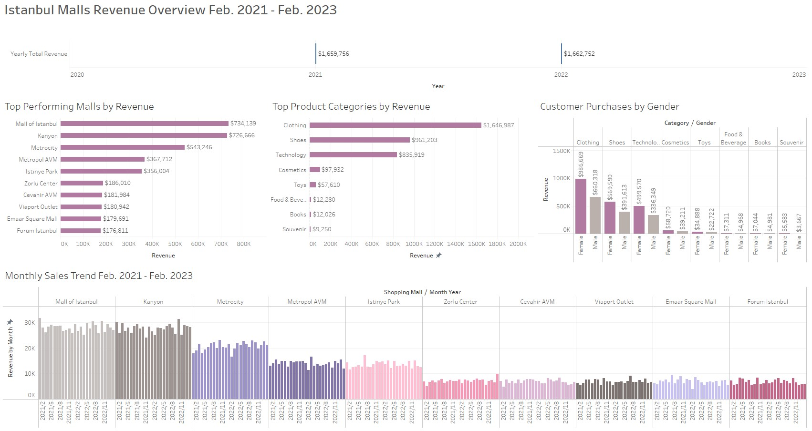

# **Istanbul Malls Revenue Performance Dashboard**

Analysis in Microsoft SQL Server on revenue data from various Istanbul malls to visualize into a comprehensive Tableau dashboard that includes KPIs, monthly revenue, and top performing malls and product categories.

Data pre-adjusted in Excel before importing into SQL Server such as fixing date columns and adjusting monetary values.

Questions for the data:
- What malls are we working with?
- For each mall, what are the top product categories that sold the highest quantities and made the most revenue?
- How are age and gender distributed?
- What are the spending habits of each gender?
- What is the cummulative yearly revenue of all malls?
- Which malls sold the most quantities and made the most revenue?
- What is the monthly and daily revenue and quantities sold for each mall?
- How many customers do each mall bring in yearly?
## **Documentation**

**Microsoft Excel Version:** Version 2408 Build 16.0.17928.20114 64-bit

**Microsoft SQL Server Mangagement Studio Version:** 18.12.1

**Tableau Public Desktop Version:** 2024.2.2

**Data Source:** ["Customer Shopping Dataset - Retail Sales Data" by Mehmet Tahir Aslan](https://www.kaggle.com/datasets/mehmettahiraslan/customer-shopping-dataset)

## **Installation**

Download csv file of data from [Kaggle](https://www.kaggle.com/datasets/mehmettahiraslan/customer-shopping-dataset)

Load into Excel and process data before loading into SQL Server

Save changes as xlsx file

Import xlsx file into MSSQL by using the **SQL Server Import and Export Wizard**

- In the object explorer, create a new database
- Right click on newly created database → Tasks → Import data
- New window for **SQL Server Import and Export Wizard** should pop up → Next →
    - Select Microsoft Excel as Data Source → 
    - Insert Excel file path and Excel version (make sure “First row has column names” is checked off) → Next → 
    - Choose file destination as **“SQL Server Native Client 11.0”** and select the database you want to import into → 
    - Select “Copy data from one or more tables or views” → Next → 
    - Confirm tables and views to copy → 
    - Check off “Run immediately” → Finish

Select database in the object explorer and can now run queries from the **[istanbulmalls.sql](https://github.com/willnguyen14/istanbul-malls-dashboard/blob/main/istanbulmalls.sql)** file in this repo.

To save a query output as an xlsx file to use for Tableau, left click the top left most cell to highlight the entire output and then right click to select “Copy with headers”

- Paste into an empty Excel spreadsheet
- Save spreadsheet as .xlsx file

Open Tableau Public Desktop and choose Microsoft Excel as data source to create dashboard.
    
## **Excel Processing**
- Prices converted from Turkish Liras to USD by using exchange rate of 1 Turkish Lira = 0.054 US Dollar as of March 2023.
- Fixed date format of `invoice_date` column.

## **[Tableau Dashboard](https://public.tableau.com/app/profile/will.nguyen/viz/IstanbulMalls/Dashboard4)**
The image below is a preview, visit my Tableau Public using the hyperlink to fully interact with the dashboard.

